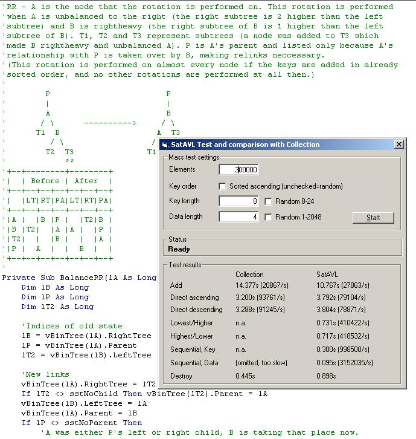



## Balanced Binary AVL Trees Using Dynamic RAM Allocation

### Description

ABSTRACT

Provides any amount of requested memory (as long

as there is available RAM) and associates that

memory with a user-defined alphanumeric key.

Features very fast retrieval in sorted order, even

faster sequential access (in the chronological

order the requests were made).

DESCRIPTION

The alphanumeric keys are associated with a

certain quantity of bytes located at a designated

position in RAM. That RAM is and remains

exclusively reserved for that Key. Via the key the

address can be returned, and also the reserved

bytes at that address. Keys are internally managed

with a balanced binary AVL tree. It is possible to

iterate through the whole collection of keys in

the order in which these keys were created (and

the memory allocated), returning the Key, the

Memory Address and the Size. It is also possible

to access all the Keys in sorted order (ascending

as well as descending). All operations are

considerabily faster than VB's Collection object

(as far as such functions are provided by the

Collection).
 
### More Info
 
Requires the type library ISHF_Ex.tlb     "IShellFolder Extended type Library v1.2" by Brad Martinez.

WARNINGS

* Whatever you do with the allocated memory, do

not forget to free it ("Set ThisClassesObject =

Nothing" will do), or you soon end up with a lot

of blocked RAM.

* Do not attempt to write data beyond the end of

the requested and allocated memory fragment!

Chances are you get a crash if you do.

             |
---                |---
**Submitted On**   |2005-04-11 05:07:40
**By**             |[Herbert Glarner](https://github.com/Planet-Source-Code/PSCIndex/blob/master/ByAuthor/herbert-glarner.md)
**Level**          |Advanced
**User Rating**    |5.0 (35 globes from 7 users)
**Compatibility**  |VB 6\.0
**Category**       |[Data Structures](https://github.com/Planet-Source-Code/PSCIndex/blob/master/ByCategory/data-structures__1-33.md)
**World**          |[Visual Basic](https://github.com/Planet-Source-Code/PSCIndex/blob/master/ByWorld/visual-basic.md)
**Archive File**   |[Balanced\_B1875434112005\.zip](https://github.com/Planet-Source-Code/herbert-glarner-balanced-binary-avl-trees-using-dynamic-ram-allocation__1-59946/archive/master.zip)

